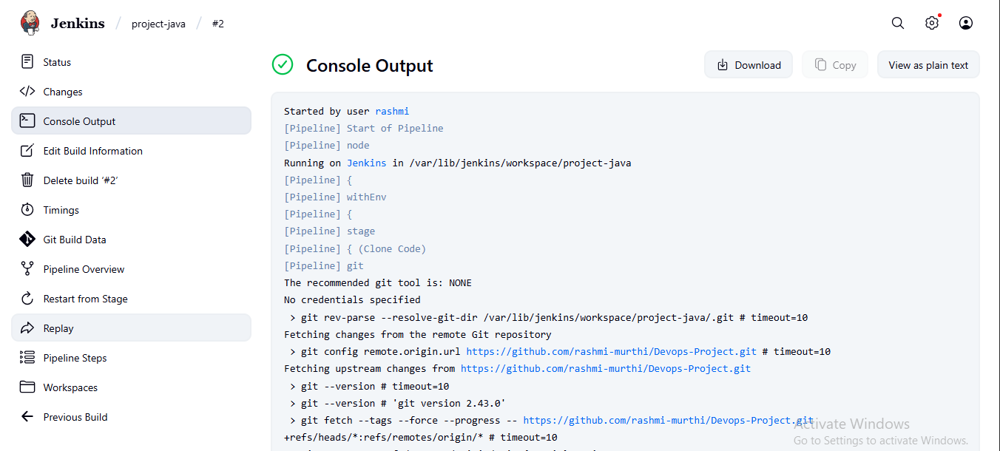
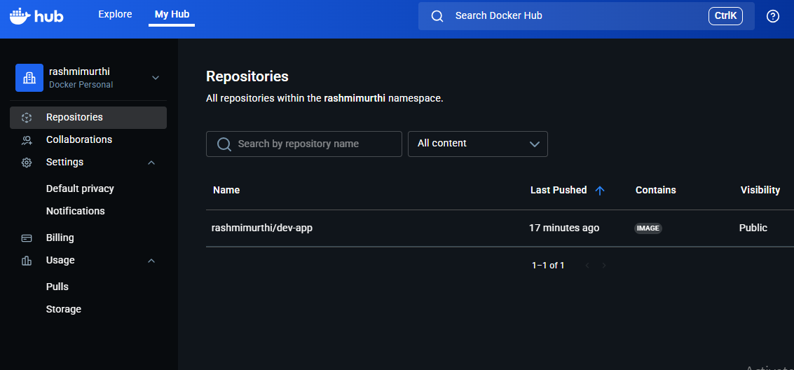
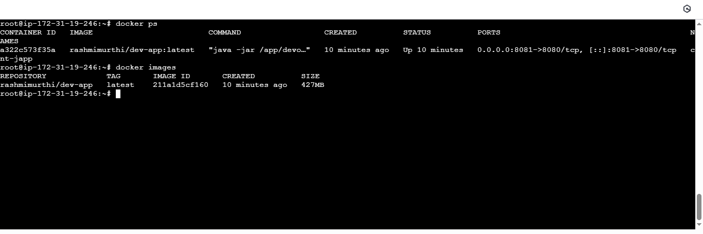
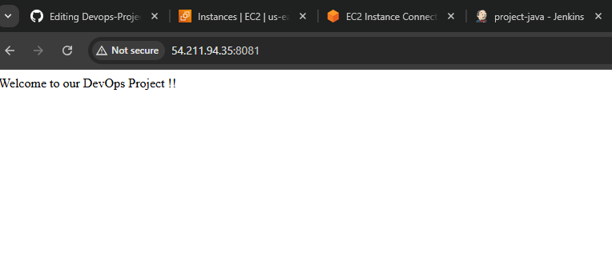

# DevOps Project

This repository demonstrates a complete DevOps workflow using a **Java Spring Boot application**, containerization with **Docker**, and CI/CD automation with **Jenkins**.

---

## 🛠️ Tech Stack

- Java (Spring Boot)  
- Maven  
- Docker  
- Jenkins  
- GitHub  

---

## 📂 Project Components

1. **Simple Java Code**
   - Spring Boot REST API (`devops-integration`)  
   - Maven project (`pom.xml`)  
   - JUnit tests  

2. **Dockerfile**
   - Defines how the Java app is packaged into a Docker container  
   - Base image: `openjdk:17-slim`  

3. **Jenkinsfile**
   - Declarative Pipeline stages:  
     - Clone code  
     - Run JUnit tests  
     - Build Maven artifacts (`.jar`)  
     - Build & tag Docker image  
     - Push Docker image to DockerHub  
     - Deploy Docker container  

---

## 🚀 CI/CD Pipeline Flow (Steps Followed)

1. **Create GitHub Repository**  
   - Push project with `pom.xml`, `Dockerfile`, and `Jenkinsfile`.

2. **Configure Jenkins**  
   - Add credentials: GitHub & DockerHub  
   - Install necessary plugins: Docker, Pipeline, GitHub, SSH Agent  

3. **Pipeline Execution**  

   - **Stage 1:** Clone code  

   - **Stage 2:** Run JUnit tests  

   - **Stage 3:** Build Maven artifacts & Docker image

       

   - **Stage 4:** Push Docker image to DockerHub

       

   - **Stage 5:** Deploy Docker container

       

4. **Verify Application**  
   - Access via browser: `http://<EC2-Public-IP>:8081`

       

---

## 📖 How to Run Locally

```bash
git clone https://github.com/<your-username>/Devops-Project.git
cd Devops-Project
mvn clean package -DskipTests
docker build -t dev-app .
docker run -d -p 8081:8080 dev-app

---
